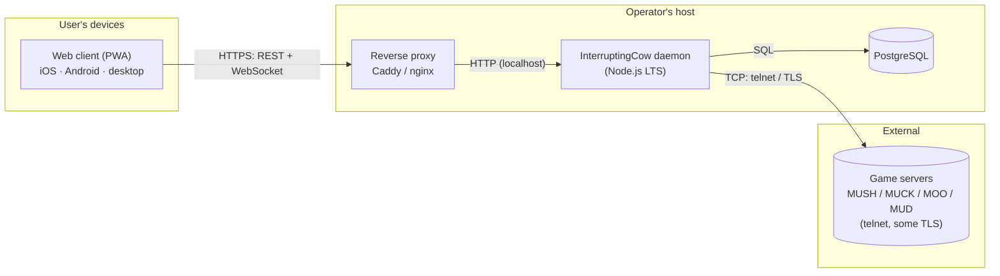
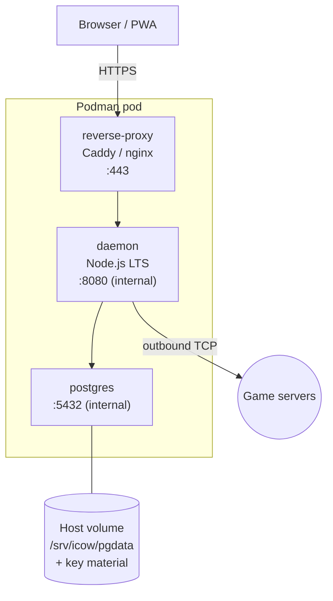
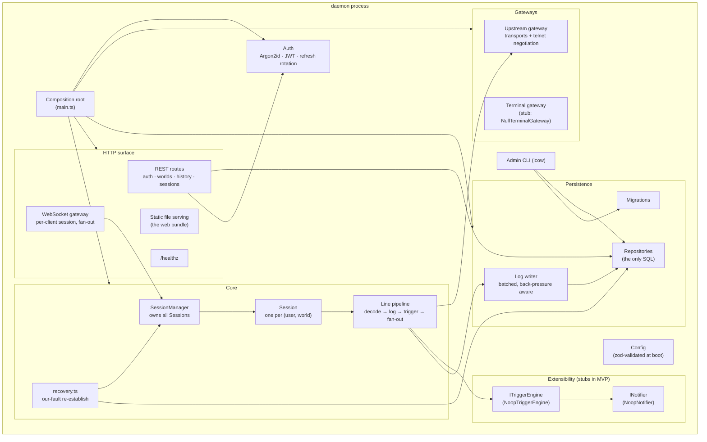
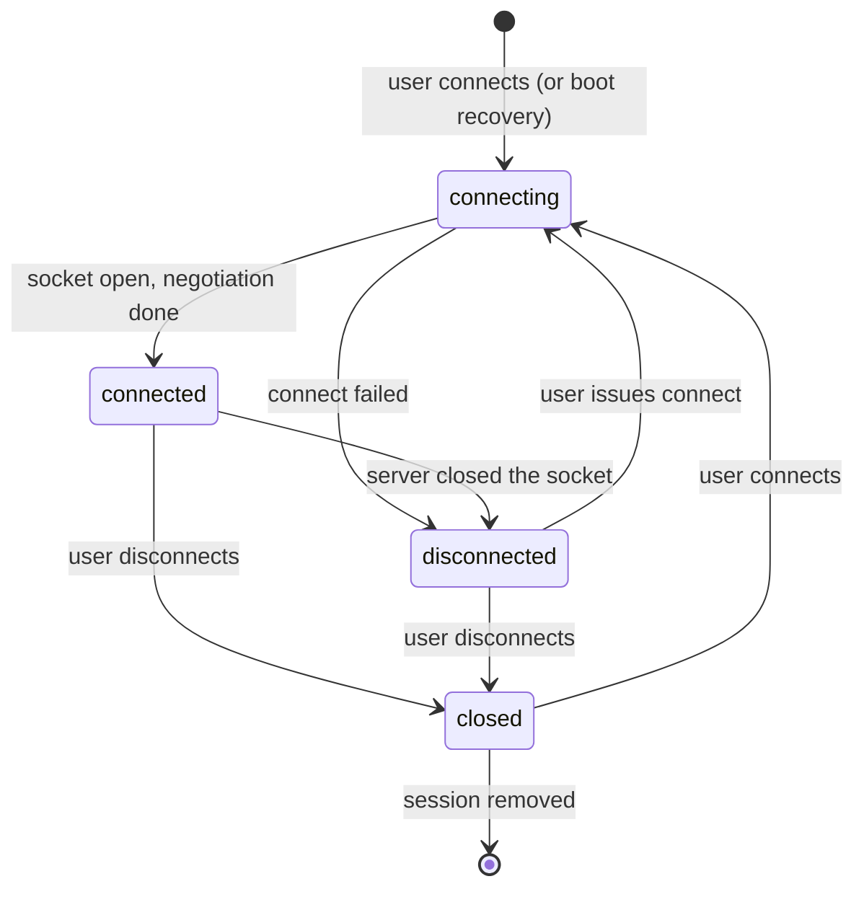

# Architecture

> **Status: design phase.** This document is the blueprint. No component
> described here exists yet. It is the distilled, maintained form of the project
> plan and is the reference the code will be built against.

## Table of contents

- [What we're building](#what-were-building)
- [Design principles](#design-principles)
- [System context](#system-context)
- [Containers (deployable units)](#containers-deployable-units)
- [The daemon, component by component](#the-daemon-component-by-component)
  - [Composition root and configuration](#composition-root-and-configuration)
  - [HTTP surface: REST and WebSocket](#http-surface-rest-and-websocket)
  - [The Session model](#the-session-model)
  - [The line pipeline](#the-line-pipeline)
  - [Upstream gateway: transports and telnet](#upstream-gateway-transports-and-telnet)
  - [Recovery: our-fault only](#recovery-our-fault-only)
  - [Triggers and notifications (stubs)](#triggers-and-notifications-stubs)
  - [The inbound terminal gateway (stub)](#the-inbound-terminal-gateway-stub)
  - [Persistence](#persistence)
  - [Authentication](#authentication)
  - [The admin CLI](#the-admin-cli)
- [The web client](#the-web-client)
- [The shared protocol package](#the-shared-protocol-package)
- [Data model](#data-model)
- [Durability and power-loss](#durability-and-power-loss)
- [Deployment](#deployment)
- [Security model](#security-model)
- [Repository layout](#repository-layout)
- [What is deliberately deferred](#what-is-deliberately-deferred)

---

## What we're building

A long-running **daemon** that maintains connections to text-based game servers
(MUSH, MUCK, MOO, MUD) on behalf of a small group of trusted users. Users
**attach** and **detach** from an installable **web client**; their game
connections keep running in between. Every line to and from every world is
**logged and full-text searchable**.

### What "forever" means

The daemon **never voluntarily drops an upstream connection**: no idle timeout,
no disconnect when the last web client detaches, no periodic recycle.

It does **not** mean chasing a server that dropped *us*. If a game server closes
the connection, the daemon surfaces that as `disconnected` and stays that way —
the user decides whether to reconnect. The only automatic reconnection is
recovery from the daemon's *own* outage (a restart, a host power loss, a local
network failure), and only for connections that were healthy before the incident.
This distinction is the subject of
[ADR 0006](adr/0006-connection-recovery-semantics.md).

---

## Design principles

1. **Separation of concerns, enforced by module boundaries.** The repository
   layer is the only code that knows SQL. The `protocol` package is the only
   cross-process contract. The upstream telnet handling never touches the
   database. Each concern has a seam.
2. **Plan for everything; build the MVP.** Anticipated features
   (triggers, push, encryption, terminal access) get their interfaces and
   no-op/stub implementations early, so adding them is not a rewrite.
3. **One language.** TypeScript everywhere — daemon, web client, and the shared
   protocol types. See [ADR 0001](adr/0001-all-typescript.md).
4. **The wire format has a single source of truth.** Defined once as zod schemas
   in `packages/protocol`, validated on both ends. See
   [ADR 0003](adr/0003-json-zod-wire-protocol.md).
5. **Durable state lives outside the container.** The daemon and its proxy are
   disposable; PostgreSQL's data directory and the encryption key material are on
   host volumes and must survive a hard power loss. See
   [ADR 0005](adr/0005-podman-pod-external-state.md).
6. **The user's words are precious.** Logs are the product. They are written
   durably, never silently dropped, and (eventually) encryptable so the operator
   can't read them.

---

## System context



- **Actors:** the users (a known, admin-provisioned group) and the operator (who
  runs the host; trusted, except where the planned zero-knowledge encryption
  removes that trust for log contents).
- **The daemon is the only thing that talks to game servers.** The web client
  never opens a game connection itself.
- **The proxy terminates TLS** and serves everything from one origin, so the web
  client has no CORS surface to configure.

---

## Containers (deployable units)



| Unit | Role | State |
|---|---|---|
| **reverse-proxy** | TLS termination, static asset serving, single origin, forwards `/api` and `/stream` to the daemon | none (config only) |
| **daemon** | everything below | none on disk; all state in PostgreSQL |
| **postgres** | the single datastore | **data directory bind-mounted from the host** |

The `postgres` container is a convenience. An external or managed PostgreSQL is
fully supported — point the daemon at a connection string and drop the container.
Either way, **the storage is not inside the pod's writable layer**.

---

## The daemon, component by component



### Composition root and configuration

`main.ts` is the only place that constructs concrete implementations and wires
them together. Everything else depends on interfaces. This keeps the graph
explicit, makes testing a matter of substituting fakes, and means the stub-vs-real
choice for triggers/notifications/terminal is one line each.

Configuration is loaded from the environment (and optionally a file), **validated
against a zod schema at startup**, and passed as a typed object. If the config is
invalid the daemon refuses to start with a clear message — "it started" implies
"the config is valid". The same `.env.example` documents every key.

### HTTP surface: REST and WebSocket

One HTTP server (Fastify is the intended framework) provides:

- **Static serving** of the built web client, so the whole product is one origin.
- **REST/JSON** for request/response interactions: authentication, listing and
  editing worlds, searching history, listing sessions. DTOs are defined in
  `packages/protocol`.
- **A WebSocket** per connected client for the live bidirectional stream. On
  connect the client authenticates (`hello`), subscribes to one or more worlds,
  receives a backfill chunk of recent scrollback, then a live stream of `line`
  and `status` messages. Client input and connect/disconnect requests flow the
  other way. **Detaching a client removes it as a subscriber and nothing else.**
- **`/healthz`** — checks the database pool and event-loop responsiveness; used
  by the proxy and the pod healthcheck.

The full message catalogue is in [the protocol document](protocol.md).

### The Session model

A **Session** is the central abstraction: **one persistent connection to one
world on behalf of one user**. It owns the upstream socket, the line pipeline for
that connection, and the set of currently-attached client subscribers.



- **`connecting`** — establishing the socket and running telnet negotiation.
- **`connected`** — live. The daemon will hold this open indefinitely.
- **`disconnected`** — not connected, but the Session and its scrollback remain.
  Reached when a connect attempt fails, or **when the game server closes the
  connection**. From here the daemon does nothing until the user acts, except in
  the specific recovery case below.
- **`closed`** — the user explicitly disconnected. Recovery will not touch a
  `closed` Session.

Key properties:

- The daemon **never** moves `connected → disconnected` on its own. Only the
  peer closing, or an error on the socket, does that.
- A server-initiated close carries a status detail of `server-closed` and is
  **terminal until the user reconnects**. No backoff loop, no retry.
- The Session object outlives every client. `SessionManager` holds all Sessions
  for the life of the process.
- Each Session **checkpoints** its durable state (world reference, whether the
  user intends it connected, current state, last activity, scrollback cursor) to
  the database, so [recovery](#recovery-our-fault-only) can make an informed
  decision after a restart.

`SessionManager` owns the map of Sessions, creates and destroys them, routes
client subscriptions, and drives recovery at boot.

### The line pipeline

Every byte in and out of a world flows through one pipeline, so that logging,
trigger evaluation, and future features have exactly one place to hook.

**Receive path (from the game):**

```
raw bytes
  → telnet decode (strip/handle IAC, apply negotiated options)
  → charset normalize (per-world encoding → internal UTF-8)
  → control handling (ANSI passed through as data; other control sequences handled or dropped)
  → append to the log  (batched via the log writer)
  → ITriggerEngine.evaluate()   (no-op in MVP)
  → fan out to attached WebSocket clients as `line` messages
```

**Send path (from a client, or later from a trigger action):**

```
client `input` message
  → telnet encode (line ending, any negotiated transforms)
  → write to the upstream socket
  → append to the log with direction = tx
```

Because the pipeline is the single choke point:

- Adding real triggers is implementing `ITriggerEngine` and returning actions;
  no other code changes.
- Adding push notifications is a `notify` action calling `INotifier`.
- Adding per-user log encryption is a branch in the log writer / repository;
  callers are unaffected.

### Upstream gateway: transports and telnet

The daemon connects **out** to game servers, which are mostly plaintext telnet
and sometimes TLS.

- **`ITransport`** abstracts the socket. Implementations: `PlainTelnetTransport`
  and `TlsTelnetTransport`. Per-world config chooses.
- **A telnet IAC state machine** handles the option-negotiation subset that
  MUSH/MUCK/MOO servers actually use:
  - **NAWS** (window size) — reported from the client's terminal size.
  - **TTYPE / MTTS** (terminal type) — a sensible identifier and capability
    bitmask.
  - **EOR / GA** (prompt marking) — used to detect prompts vs. lines.
  - **SUPPRESS-GO-AHEAD**.
  - **CHARSET** — negotiate UTF-8 where offered; fall back to the per-world
    configured encoding.
- **Registered-but-stubbed options**, each its own module so implementing it
  later is local: **MCCP2** (zlib output compression), **GMCP** (structured
  data), **MXP** (in-band markup), **MSSP** (server metadata).

Untrusted data from a game server is treated as hostile input: the state machine
must not be crashable by malformed IAC sequences, over-long lines, or partial
negotiations.

### Recovery: our-fault only

`recovery.ts` runs once, at daemon boot. Its job is to restore connections that
*we* dropped by restarting or losing power — **not** to reconnect anything a
server closed or a user closed.

Algorithm:

1. Read every Session's last checkpoint from `session_state`.
2. Consider a Session for recovery only if **all** hold:
   - the user's **intent** was `connected` (`intended_connected = true`), and
   - its **state at the last checkpoint** was `connected` (not `disconnected`,
     not `closed`), and
   - the world's `auto_recover` flag is on (default true), and
   - the daemon was down for less than a configurable **grace window** (the
     heuristic for "this was our outage, not a deliberate stop hours ago").
3. For each such Session, attempt to re-establish, with bounded retries and
   backoff. On success it returns to `connected`. On exhausting the attempts it
   is left `disconnected` with a status the user sees; it is not retried further.

Everything else — a Session that was `disconnected` (including `server-closed`)
or `closed` at checkpoint time, a world with `auto_recover` off, a restart
outside the grace window — is left exactly as it was. See
[ADR 0006](adr/0006-connection-recovery-semantics.md) for the rationale and the
alternatives considered.

An optional per-world **application-level keepalive** (a periodic no-op write)
may be configured purely to keep NAT/firewall state alive on an idle connection.
It does not participate in reconnect logic.

### Triggers and notifications (stubs)

- **`ITriggerEngine`** — MVP ships `NoopTriggerEngine`. The interface takes a
  line and returns a list of **actions**: `gag` (suppress display), `highlight`
  (mark up), `send` (write a command back), `notify` (raise a notification). The
  real engine will hold per-world, server-stored rule sets edited in the web
  client.
- **`INotifier`** — MVP ships `NoopNotifier`. The real implementation will be a
  `WebPushNotifier` (VAPID), invoked by `notify` actions. Push is deliberately
  **downstream of triggers** so it never fires on every line.

### The inbound terminal gateway (stub)

MVP ships **`NullTerminalGateway`** behind an `ITerminalGateway` interface, and
binds no listener. There is **no plaintext telnet _into_ the daemon** — it can't
do modern authentication and would put credentials and private logs in cleartext.
See [ADR 0004](adr/0004-defer-terminal-gateway.md). A future TLS line-terminal or
embedded SSH gateway can be added against this interface without touching the
core.

### Persistence

All SQL lives in the **repository layer**. No ORM; parameterized queries.
Interfaces: `UserRepo`, `TokenRepo`, `WorldRepo`, `SessionStateRepo`,
`LineLogRepo`. Nothing outside `persistence/` imports the database driver.

- **Migrations** are versioned and run by the CLI. Every migration has a tested
  rollback.
- **The log writer** batches line inserts (e.g. up to N lines or M milliseconds,
  whichever first) inside real transactions, applies back-pressure if the
  database can't keep up, and **flushes on shutdown**. A crash loses at most one
  un-flushed batch of scrollback — never committed data, never integrity.

### Authentication

- **Accounts are admin-provisioned** via the CLI. No self-serve signup in the
  supported scope.
- **Passwords** are hashed with **Argon2id**.
- **Login** issues a short-lived **access token** (a JWT, used for REST calls and
  to authorize the WebSocket `hello`) and a long-lived **refresh token** (an
  httpOnly cookie). Refresh tokens **rotate** on use and can be revoked
  server-side.
- The web client stores **only** a token; everything else it needs comes from the
  server.
- **Optional TOTP two-factor** is a documented post-MVP addition; the auth module
  is shaped to accommodate it.

### The admin CLI

`icow` is the operator's tool:

- `icow migrate` — run pending database migrations.
- `icow user add | remove | passwd` — manage accounts.
- `icow world add | list` — manage a user's worlds.
- `icow token mint` — issue a token out of band.

---

## The web client

An **Angular** application, delivered as an installable **Progressive Web App**.

- **Installable** on iOS (16.4+, added to the Home Screen), Android, and desktop
  browsers that support PWA installation. A web app manifest and a service worker
  provide the installable shell and offline chrome.
- **`core/`** — token storage (a single token, held in memory with the refresh
  cookie doing the persistence), an auth interceptor, and a `WsClientService`
  that speaks the `protocol` package's message types through its codec.
- **`data/`** — typed REST clients for worlds, history, and settings.
- **Features:**
  - **terminal** — an output pane that renders ANSI SGR as styled spans, an
    input line with command history and basic tab-completion, auto-scroll with a
    scroll-lock.
  - **worlds** — the world list with live connection status; connect / disconnect;
    attach / detach.
  - **history** — a scrollback view and a full-text search box over all logged
    lines.
  - **settings** — account settings and per-world preferences. Includes a visible
    **Source** link to satisfy AGPL §13 (offering users the running service's
    source). The **triggers** route exists but renders a "coming soon"
    placeholder in the MVP.
- **Server-side storage by default.** The client persists as little as possible:
  the auth token and a few UI preferences. Scrollback, world configuration, and
  settings are fetched from the daemon.

---

## The shared protocol package

`packages/protocol` is the contract between the daemon and the web client, and
has **no runtime dependencies beyond zod**.

- **Every WebSocket message** and **every REST DTO** is a zod schema; the
  TypeScript types are *inferred from* the schemas, so the types and the runtime
  validation can never drift.
- Messages form **discriminated unions** on a `t` (type) field.
- A **`Codec` interface** abstracts encoding. The MVP ships `JsonCodec`. A
  `MsgpackCodec` (or similar) can be added later without changing any message
  handler.
- The **`hello` handshake carries a protocol version**, so the daemon and client
  can evolve on independent release cadences and negotiate compatibility.
- A sample corpus (one fixture per message) will live in the package's tests and
  double as the fixtures for the daemon↔client contract tests.

See [the protocol document](protocol.md) for the full catalogue.

---

## Data model

PostgreSQL. Shapes below are indicative, not final DDL — the authoritative schema
will be the migrations.

| Table | Purpose | Notes |
|---|---|---|
| `users` | accounts | `id`, `handle`, `argon2id_hash`, `created_at`, `is_admin`, `totp_secret` (nullable, post-MVP) |
| `tokens` | refresh tokens and access-token JTIs | `id`, `user_id`, `kind`, `hash`, `expires_at`, `revoked_at` |
| `worlds` | a user's game connections | `id`, `user_id`, `name`, `host`, `port`, `tls`, `encoding`, `auto_recover` (default true), `autologin_ref`. **Game credentials are encrypted at rest** (libsodium secretbox; key from host secret material, **not** in the image). |
| `session_state` | per-world checkpoint for recovery | `world_id` (PK), `state`, `intended_connected`, `last_activity_at`, `last_checkpoint_at`, `scrollback_cursor` |
| `lines` | the log — every line, both directions | `id` (bigserial), `world_id`, `ts`, `dir` (`rx`/`tx`), `text`, `tsv` (generated `tsvector`). **Partitioned by month** so retention is "drop a partition" and the full-text index stays healthy. GIN index on `tsv`. |
| `lines_enc` | ciphertext log for encrypted worlds | **A later migration, not MVP.** `world_id`, `ts`, `nonce`, `ciphertext` (bytea). When a world is encrypted, its lines go here and server-side full-text search is bypassed. |

`auto_recover` gates **our-fault boot recovery only**. It is **not** a
"reconnect when the server drops me" switch — there is no such switch.

---

## Durability and power-loss

The operator's requirement: **all persistent state survives a hard power loss,
and nothing durable lives inside the pod.**

- The **PostgreSQL data directory is a host bind-mount** (e.g.
  `/srv/icow/pgdata`). Recreating the pod or any container does not touch it. The
  same applies to the game-credential encryption key material and any log-file
  archives.
- PostgreSQL runs with `fsync=on`, `synchronous_commit=on`,
  `full_page_writes=on`, `wal_level=replica`. Backups are scheduled `pg_dump`
  plus, optionally, WAL archiving to a second host path or offsite.
- The **log writer flushes its batch on shutdown**. On an ungraceful kill, at
  most one un-flushed batch of scrollback is lost; committed data is intact and
  the database is never left corrupt (PostgreSQL recovers via WAL on restart).
- The pod restarts the daemon on failure; `/healthz` gates traffic.
- The procedure — volume layout, `pg_dump`/restore, and the "pull the plug"
  recovery expectation — is documented in
  [the runbook](operations/runbook.md) and
  [backup & restore](operations/backup-restore.md), and the restore path is
  marked **untested until it has actually been exercised**.

See [ADR 0005](adr/0005-podman-pod-external-state.md).

---

## Deployment

A **Podman pod** with three containers sharing a network namespace:

```
reverse-proxy (Caddy/nginx, :443)  ──►  daemon (Node.js, internal)  ──►  postgres (internal)
                                                                              │
                                                                    /srv/icow/pgdata  (host bind-mount)
```

- The proxy terminates TLS, serves the static bundle, and forwards `/api` and
  `/stream` to the daemon.
- The daemon holds no disk state.
- Postgres' data directory is on the host. An external managed Postgres is an
  alternative (set a connection string, drop the container).
- Deployment for now is **pull-based and manual**: the operator re-pulls a pinned
  image tag and restarts the pod, per the runbook. Automated deploy is a
  documented future step, not part of the initial build.

---

## Security model

- **Transport:** the web client reaches the daemon only over HTTPS (proxy-
  terminated). No plaintext client transport. No inbound telnet.
- **Authentication:** Argon2id passwords, short-lived access tokens, rotating
  refresh tokens, server-side revocation. Optional TOTP later.
- **Trust boundary:** the operator is trusted for availability and for
  everything except — once it ships — the contents of **encrypted** worlds' logs,
  which zero-knowledge per-user encryption is designed to keep even from the
  operator.
- **Game credentials** are encrypted at rest with key material kept off the
  container image.
- **Untrusted input:** data from game servers is parsed defensively; the telnet
  state machine and line handling must be robust to hostile or malformed streams.
- **AGPL §13:** because InterruptingCow is offered as a network service, the web
  client exposes a **Source** link so users can obtain the running (possibly
  modified) source. See [ADR 0007](adr/0007-licensing-and-workflow.md).
- **Supply chain:** dependency and code scanning, pinned base images, and signed
  releases are on the [roadmap](../ROADMAP.md); see also [`SECURITY.md`](../SECURITY.md).

---

## Repository layout

Planned. Only the documentation and the per-package placeholder READMEs exist in
this first commit.

```
InterruptingCow/
├── README.md, LICENSE, CONTRIBUTING.md, GOVERNANCE.md, MAINTAINERS.md,
│   SECURITY.md, SUPPORT.md, ROADMAP.md, CHANGELOG.md, AUTHORS
├── docs/                     # this documentation
│   ├── index.md, architecture.md, protocol.md, glossary.md
│   ├── adr/                  # 0000 process, template, 0001–0007
│   ├── development/          # getting-started, coding-standards, environment,
│   │                         #   testing, releasing, troubleshooting
│   ├── operations/           # runbook, backup-restore
│   └── user-guide/           # install, worlds, history, notifications
├── packages/
│   ├── protocol/             # shared zod schemas + inferred types + codec
│   ├── daemon/               # the service
│   │   └── src/
│   │       ├── main.ts               # composition root
│   │       ├── config/
│   │       ├── http/                 # routes/ + ws/
│   │       ├── session/              # session, session-manager, recovery, line-pipeline
│   │       ├── gateways/
│   │       │   ├── upstream/         # transport/ + telnet/ (+ stub options)
│   │       │   └── terminal/         # ITerminalGateway + NullTerminalGateway (stub)
│   │       ├── triggers/             # ITriggerEngine + NoopTriggerEngine (stub)
│   │       ├── notifications/        # INotifier + NoopNotifier (stub)
│   │       ├── persistence/          # repositories/ + migrations/ + log-writer
│   │       ├── auth/
│   │       └── cli/                  # the `icow` command
│   └── web/                  # Angular PWA
├── e2e/                      # end-to-end suite + the fake MU* server fixture
├── deploy/                   # Podman pod, proxy config, Containerfile
└── .github/                  # workflows, templates, CODEOWNERS
```

---

## What is deliberately deferred

| Deferred | Why | Seam that's in place |
|---|---|---|
| Triggers / aliases / gags / highlights | MVP is the persistence promise; triggers are a large feature in their own right | `ITriggerEngine`, evaluated in the line pipeline |
| Push notifications | Must be gated on triggers to be usable | `INotifier`, invoked by `notify` actions |
| Zero-knowledge log encryption | Significant crypto + UX design; needs the plaintext path working first | log writer / repository branch; `lines_enc` table planned |
| Inbound terminal (TLS or SSH) | Plaintext telnet in is unacceptable; a secure gateway is real work | `ITerminalGateway`, `NullTerminalGateway` |
| MCCP2 / GMCP / MXP / MSSP | Not needed for basic play; each is self-contained | one stub module per option in the telnet layer |
| Self-serve registration / multi-tenant | Out of the supported scope; much more infrastructure | admin CLI is the only account path today |
| Automated deployment | Manual pull is fine at this scale | deploy config is a normal artifact |

See [`ROADMAP.md`](../ROADMAP.md) for sequencing.
