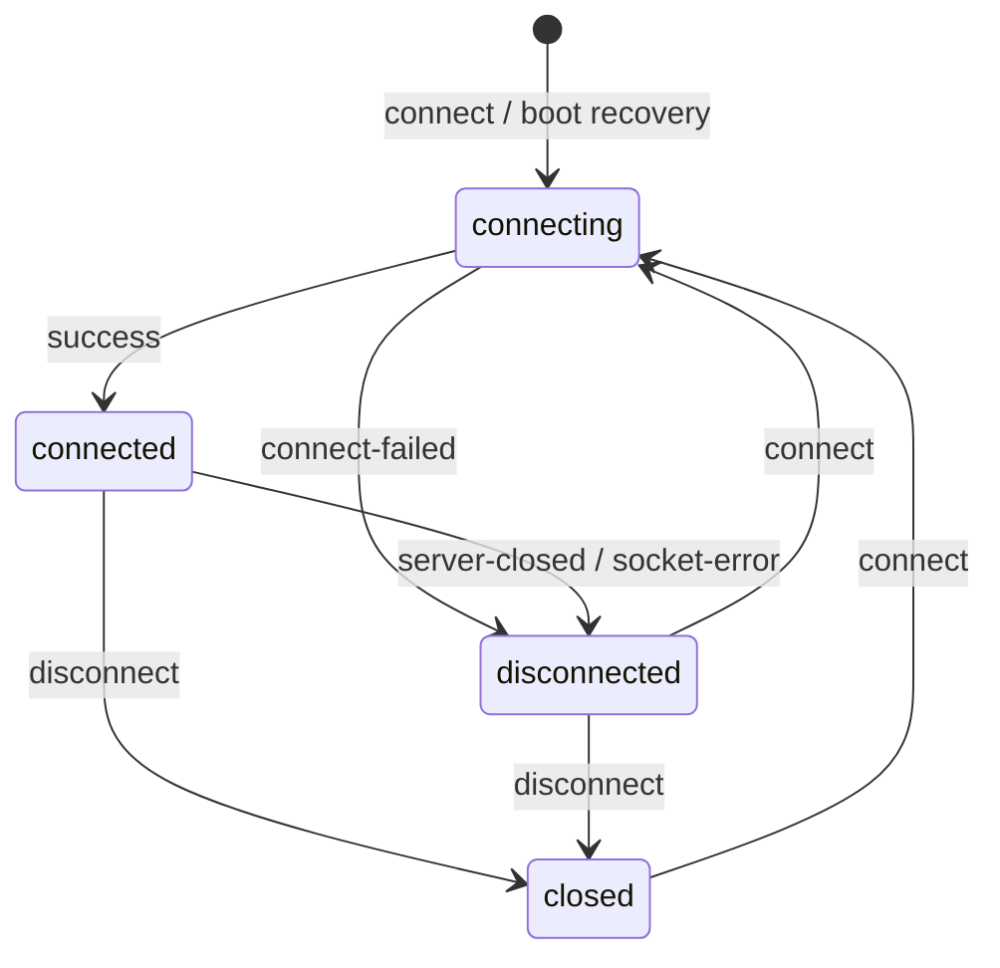

# Wire Protocol

> **Status: design phase.** This is a specification to build to and review, not a
> description of running code. The authoritative form, once it exists, will be
> the zod schemas in `packages/protocol`; where this document and those schemas
> disagree, the schemas win. Parts of this document are intended to be
> **generated** from the schemas.

## Overview

The web client and the daemon communicate over two channels, both reached through
the reverse proxy over HTTPS, from a single origin:

| Channel | Use | Shape |
|---|---|---|
| **REST / JSON** | request/response: authentication, world management, history search, session listing | ordinary HTTP with JSON bodies; DTOs defined in `packages/protocol` |
| **WebSocket** | the live bidirectional stream: attach/detach, lines to and from worlds, status changes | discriminated-union messages, one per frame, encoded by a pluggable `Codec` (JSON for now) |

Design rules:

- **One source of truth.** Every message and DTO is a zod schema in
  `packages/protocol`; TypeScript types are inferred from the schemas. Both the
  daemon and the client validate against them.
- **Discriminated unions.** Every WebSocket message has a string `t` field that
  selects its variant.
- **Versioned.** The `hello` handshake carries a protocol version so client and
  daemon can be released independently and negotiate compatibility.
- **Codec-agnostic.** A `Codec` interface (`encode(message) → bytes`,
  `decode(bytes) → message`) wraps the wire encoding. `JsonCodec` ships first; a
  binary codec can replace it without touching handlers.

Notation below: `?` marks an optional field. Timestamps are integer milliseconds
since the Unix epoch (UTC). Identifiers are opaque strings unless stated.

---

## Authentication and tokens

- **Access token** — a short-lived JWT. Sent as `Authorization: Bearer <jwt>` on
  REST calls, and inside the WebSocket `hello` message. Carries the user id and a
  JTI.
- **Refresh token** — long-lived, delivered and stored as an **httpOnly, Secure,
  SameSite** cookie. Rotates on every use; the previous value is revoked.
  Presenting a revoked refresh token invalidates the whole chain (reuse
  detection).
- The client keeps the access token in memory only. It never sees the refresh
  token value (the browser holds the cookie).

---

## REST API

Base path: `/api`. All bodies are JSON. All endpoints except `POST /api/auth/login`
require a valid access token.

### `POST /api/auth/login`

Request:

```json
{ "handle": "jane", "password": "•••••", "totp": "123456" }
```

`totp` is required only once TOTP is enabled for the account (post-MVP).

Response `200`:

```json
{
  "accessToken": "<jwt>",
  "accessExpiresAt": 1737000000000,
  "user": { "id": "u_123", "handle": "jane", "isAdmin": false }
}
```

Sets the refresh-token cookie. `401` on bad credentials; `429` on too many
attempts.

### `POST /api/auth/refresh`

No body; uses the refresh cookie. Response `200` mirrors `login` (new access
token, rotated refresh cookie). `401` if the cookie is missing, expired, or
revoked.

### `POST /api/auth/logout`

No body. Revokes the current refresh chain and clears the cookie. `204`.

### `GET /api/worlds`

Response `200`:

```json
{
  "worlds": [
    {
      "id": "w_abc",
      "name": "ExampleMUSH",
      "host": "mush.example.net",
      "port": 4201,
      "tls": false,
      "encoding": "utf-8",
      "autoRecover": true
    }
  ]
}
```

Game credentials are **never** returned.

### `GET /api/sessions`

The live state of the caller's worlds.

```json
{
  "sessions": [
    { "worldId": "w_abc", "state": "connected",    "since": 1736990000000, "attachedClients": 1 },
    { "worldId": "w_def", "state": "disconnected", "since": 1736995000000, "detail": "server-closed" }
  ]
}
```

`state` is one of `connecting | connected | disconnected | closed` (see
[Status and the Session state machine](#status-and-the-session-state-machine)).

### `GET /api/history`

Full-text and/or time-ranged search over logged lines.

Query parameters:

| Param | Meaning |
|---|---|
| `worldId` | required; which world's log |
| `q` | optional; full-text query (PostgreSQL `tsquery` semantics, sanitised) |
| `before` | optional; return lines with `ts <` this value (for paging backward) |
| `after` | optional; return lines with `ts >` this value |
| `limit` | optional; max rows, server-clamped (e.g. ≤ 500) |

Response `200`:

```json
{
  "lines": [
    { "ts": 1736990001000, "dir": "rx", "text": "Jane arrives from the west." },
    { "ts": 1736990002000, "dir": "tx", "text": "wave" }
  ],
  "hasMore": true
}
```

For an **encrypted** world (post-MVP), the server cannot search; it returns
`409 Conflict` with `{ "error": "encrypted", "message": "search this world client-side" }`
and the client fetches ciphertext ranges and searches locally.

### Error shape

Non-2xx responses use:

```json
{ "error": "short_code", "message": "human-readable explanation" }
```

---

## WebSocket

Endpoint: `/stream`. One connection per client tab. After the TCP/TLS upgrade the
client must send `hello` before anything else; the server closes the socket if
the first message is not a valid, authenticated `hello` within a short timeout.

### Framing

- One message per frame.
- `JsonCodec`: the frame is UTF-8 JSON of the message object.
- Every message has `t` (type). Client→server and server→client namespaces are
  disjoint.

### Client → server messages

#### `hello`

```json
{
  "t": "hello",
  "protocol": 1,
  "accessToken": "<jwt>",
  "client": { "name": "web", "version": "0.1.0" },
  "terminal": { "cols": 100, "rows": 40 }
}
```

- `protocol` — the protocol version the client speaks. The server replies with
  `ready` if compatible, or `error` with `code: "protocol-unsupported"` and then
  closes.
- `terminal` — optional; used to answer the game's NAWS negotiation. May be
  updated later with `resize`.

#### `subscribe`

```json
{ "t": "subscribe", "worldIds": ["w_abc", "w_def"] }
```

Attach this client as a subscriber to those worlds' Sessions. The server responds
with a `history` backfill for each, then live `line`/`status` messages. Attaching
does not change a Session's connection state.

#### `unsubscribe`

```json
{ "t": "unsubscribe", "worldIds": ["w_def"] }
```

Detach from those worlds. **This only removes this client as a subscriber.** The
Session keeps running.

#### `input`

```json
{ "t": "input", "worldId": "w_abc", "text": "say hello", "id": "c_9f3" }
```

A line to send to the world. `id` is an optional client-supplied correlation id;
if present the server echoes it back on the resulting `line` (or on an `error`).
`text` is a single logical line without the terminator; the daemon appends the
negotiated line ending.

#### `connect` / `disconnect`

```json
{ "t": "connect",    "worldId": "w_abc" }
{ "t": "disconnect", "worldId": "w_abc" }
```

- `connect` — ask the daemon to establish (or re-establish) the upstream
  connection. Valid from `disconnected` or `closed`. Moves the Session to
  `connecting`.
- `disconnect` — ask the daemon to close the upstream connection. Moves the
  Session to `closed`. This is the **only** way a connection closes at the user's
  request, and `closed` Sessions are exempt from boot recovery.

#### `resize`

```json
{ "t": "resize", "cols": 120, "rows": 50 }
```

Updated terminal dimensions; the daemon re-issues NAWS to any affected worlds.

#### `ping`

```json
{ "t": "ping", "ts": 1737000000000 }
```

Liveness probe; server replies `pong`.

### Server → client messages

#### `ready`

```json
{
  "t": "ready",
  "protocol": 1,
  "session": { "userId": "u_123", "handle": "jane" },
  "sessions": [
    { "worldId": "w_abc", "state": "connected", "since": 1736990000000 }
  ]
}
```

Sent once, in response to a valid `hello`. `sessions` is the current state of all
the user's worlds so the client can render immediately, before subscribing.

#### `history`

```json
{
  "t": "history",
  "worldId": "w_abc",
  "lines": [
    { "ts": 1736989000000, "dir": "rx", "text": "The sun sets over the hills." }
  ],
  "cursor": "h_00c1",
  "hasMore": true
}
```

A backfill chunk sent after `subscribe`. The client may request older chunks via
`GET /api/history` (the REST and WebSocket history shapes are intentionally
similar). `hasMore` indicates whether earlier scrollback exists.

#### `line`

```json
{
  "t": "line",
  "worldId": "w_abc",
  "ts": 1736990003000,
  "dir": "rx",
  "text": "Jane says, \"hi there\"",
  "spans": [
    { "start": 0, "end": 4, "fg": "cyan" }
  ],
  "id": "c_9f3"
}
```

- `dir` — `rx` (from the game) or `tx` (something this user sent, echoed to all
  their attached clients).
- `text` — the line with control bytes removed; **UTF-8**.
- `spans` — optional pre-parsed styling (from ANSI SGR). Clients may use these or
  parse `text` themselves. Absent means "no styling".
- `id` — present only when echoing a client `input` that carried one.

#### `status`

```json
{ "t": "status", "worldId": "w_abc", "state": "disconnected", "detail": "server-closed", "ts": 1736990100000 }
```

A change in a Session's connection state. See the state machine below.

#### `pong`

```json
{ "t": "pong", "ts": 1737000000000 }
```

Echoes the `ping` timestamp.

#### `error`

```json
{ "t": "error", "code": "not-subscribed", "message": "subscribe to w_abc before sending input", "worldId": "w_abc", "id": "c_9f3" }
```

A non-fatal problem with a specific request (`id`/`worldId` scope it where
possible). Fatal problems (bad `hello`, unsupported protocol) are an `error`
followed by the server closing the socket.

Indicative `code` values: `protocol-unsupported`, `unauthenticated`,
`token-expired`, `not-subscribed`, `unknown-world`, `invalid-message`,
`rate-limited`, `world-encrypted`, `internal`.

---

## Status and the Session state machine

`state` values in `status`, `ready`, and `GET /api/sessions`:

| State | Meaning |
|---|---|
| `connecting` | establishing the socket / negotiating |
| `connected` | live; the daemon holds this open indefinitely |
| `disconnected` | not connected, Session and scrollback retained; the daemon will not reconnect on its own |
| `closed` | the user explicitly disconnected; exempt from boot recovery |



`detail` strings that accompany a `status`:

| `detail` | With state | Meaning |
|---|---|---|
| `connecting` | `connecting` | attempt started |
| `connected` | `connected` | up |
| `server-closed` | `disconnected` | the game server closed the connection. **Terminal until the user sends `connect`.** No automatic retry. |
| `socket-error` | `disconnected` | the connection failed unexpectedly (not a clean close). Also not retried automatically. |
| `connect-failed` | `disconnected` | a `connect` attempt did not succeed |
| `recovered` | `connected` | re-established by our-fault boot recovery |
| `recovery-failed` | `disconnected` | boot recovery gave up after bounded attempts |
| `user-disconnected` | `closed` | the user issued `disconnect` |

The critical rule, restated: **the daemon never moves a Session from `connected`
to `disconnected` by itself, and never moves it from `disconnected` back toward
`connected` by itself** — except for [our-fault boot recovery](architecture.md#recovery-our-fault-only),
which acts only on Sessions that were `connected` and intended-connected at the
last checkpoint, within the grace window. See
[ADR 0006](adr/0006-connection-recovery-semantics.md).

---

## Versioning and compatibility

- The protocol has an integer **version**, sent in `hello` and echoed in `ready`.
- The daemon advertises a **minimum** and **current** supported version. A client
  below the minimum is rejected with `protocol-unsupported`.
- **Additive** changes (new optional fields, new message types a client may
  ignore) do not bump the version.
- **Breaking** changes (removed/renamed fields, changed semantics) bump it and
  are recorded in an ADR and the changelog.
- Pre-1.0, breaking protocol changes may land in minor releases; they will always
  be called out.

---

## Generation

Once `packages/protocol` exists, the message and DTO tables in this document are
intended to be **generated from the zod schemas** (schema → Markdown table),
leaving only the prose here hand-written. Until then this document is maintained
by hand and is the spec the schemas must match.
